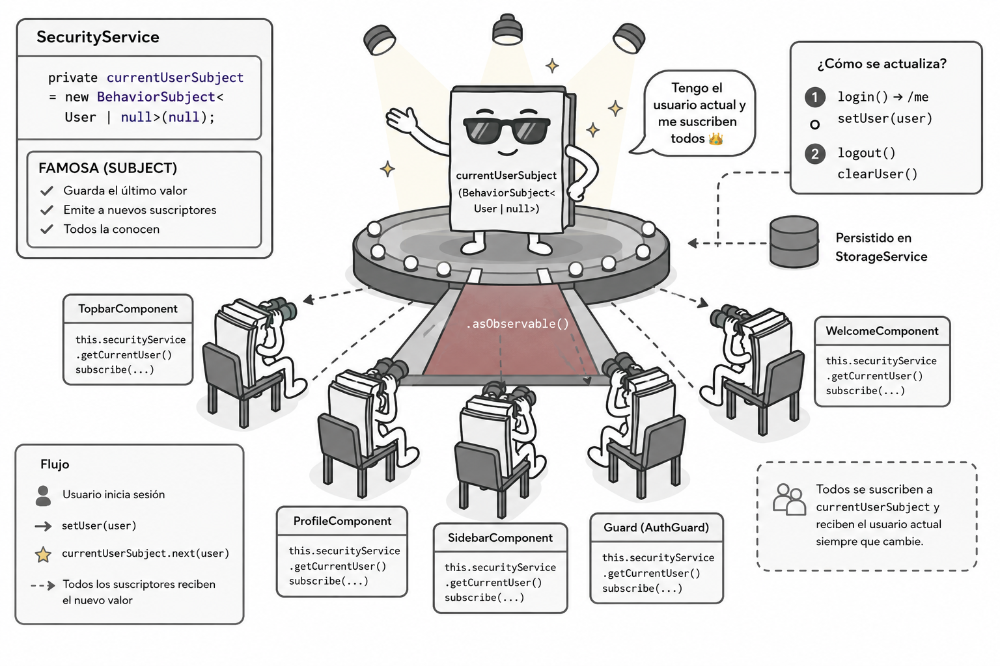

1. Crear carpeta en `src/app/services/storage`
2. Internamente crear 2 archivos llamados: `storage.service.interface.ts` y `storage.service.ts`

3. Internamente dentro del archivo `storage.service.interface.ts`
``` typescript
export interface IStorageService {
    getItem(key: string): string | null;
    setItem(key: string, value: string): void;
    removeItem(key: string): void;
    getObject<T = any>(key: string): T | null;
    setObject(key: string, value: any): void;
}
```
4. En el archivo `storage.service.ts`

``` typescript
import { Injectable } from '@angular/core';
import { IStorageService } from './storage.service.interface';

@Injectable({
    providedIn: 'root',
})
export class StorageService implements IStorageService {
    private readonly fallback = new Map<string, string>();

    getItem(key: string): string | null {
        try {
            return localStorage.getItem(key);
        } catch (e) {
            return this.fallback.get(key) ?? null;
        }
    }

    setItem(key: string, value: string): void {
        try {
            localStorage.setItem(key, value);
        } catch (e) {
            this.fallback.set(key, value);
        }
    }

    removeItem(key: string): void {
        try {
            localStorage.removeItem(key);
        } catch (e) {
            this.fallback.delete(key);
        }
    }

    getObject<T = any>(key: string): T | null {
        const raw = this.getItem(key);
        if (!raw) return null;
        try {
            return JSON.parse(raw) as T;
        } catch (e) {
            return null;
        }
    }

    setObject(key: string, value: any): void {
        try {
            this.setItem(key, JSON.stringify(value));
        } catch (e) {
            // ignore
        }
    }
}
```
5. Creación del servicio `SecurityService`
``` sh
ng g s services/Security
```



Que tendrá el siguiente código:

``` typescript
import { Injectable } from '@angular/core';
import { HttpClient } from '@angular/common/http';
import { BehaviorSubject, Observable, of } from 'rxjs';
import { tap, switchMap, catchError } from 'rxjs/operators';
import { environment } from '../../environments/environments';
import { User } from '../models/user';
import { StorageService } from './storage/storage.service';

@Injectable({
  providedIn: 'root',
})
export class SecurityService {
  private api = environment.apiUrl;

  private currentUserSubject = new BehaviorSubject<User | null>(null);

  private readonly storageKey = 'currentUser';

  constructor(private http: HttpClient, private storage: StorageService) {
    // Al crear el servicio, intentar cargar usuario persistido
    try {
      const raw = this.storage.getItem(this.storageKey);
      if (raw) {
        const u: User = JSON.parse(raw);
        this.currentUserSubject.next(u);
      }
    } catch (e) {
      // ignore parse errors
      console.warn('Failed to load user from localStorage', e);
    }
  }

  /**
   * Este método realiza el proceso de login:
   * 1. Envía las credenciales al backend para autenticación.
   * 2. Si el login es exitoso, llama a /me para obtener los datos del usuario actual.
   * 3. Actualiza el estado del usuario en el servicio y lo persiste en storage.
   * Es importante que el backend esté configurado para manejar sesiones (por ejemplo, con cookies)
   * y que el endpoint /me valide la sesión y devuelva el usuario correspondiente.
   * @param user 
   * @returns 
   */


  login(user: User): Observable<any> {
    const url = `${this.api}/api/auth/login`;
    return this.http.post<any>(url, user, { withCredentials: true }).pipe(
      tap(() => console.log('✅ Login exitoso, llamando /me...')),
      switchMap(() =>
        this.me().pipe(
          tap((u) => {
            console.log('✅ /me respondió:', u);
            this.setUser(u);
          }),
          catchError((err) => {
            console.error('❌ /me falló:', err.status, err.error);
            this.setUser(null);
            return of(null);
          })
        )
      )
    );
  }

  /**
   * Este método realiza el proceso de logout:
   * 1. Llama al endpoint de logout en el backend para invalidar la sesión.
   * 2. Limpia el estado del usuario en el servicio y en el storage.
   * Es importante que el backend maneje correctamente la invalidación de la sesión (por ejemplo, eliminando la cookie).
   * @returns 
   */
  logout(): Observable<any> {
    const url = `${this.api}/api/auth/logout`;
    return this.http.post(url, {}, { withCredentials: true }).pipe(
      tap(() => this.clearUser())
    );
  }

  /**
   * Llama al endpoint /me para obtener los datos del usuario actual. 
   * Se espera que el backend valide la sesión
   * y devuelva el usuario correspondiente o un error si no hay sesión válida.
   * La cookie de sesión debe ser enviada automáticamente por el navegador
   * debido a { withCredentials: true }.
   * @returns 
   */

  me(): Observable<User> {
    const url = `${this.api}/api/auth/me`;
    return this.http.get<User>(url, { withCredentials: true });
  }

  /** Devuelve el observable público del usuario actual */
  public getCurrentUser(): Observable<User | null> {
    return this.currentUserSubject.asObservable();
  }

  /**
   * Actualiza el estado del usuario actual en el servicio y lo persiste en storage.
   * Este método se llama después de un login exitoso para establecer el usuario actual,
   * o después de un logout para limpiar el usuario.
   * Es importante no almacenar la contraseña en el storage por razones de seguridad.
   * @param user 
   */

  setUser(user: User | null) {
    console.log('🔐 Estableciendo usuario actual:', user);
    this.currentUserSubject.next(user);
    // Persistir en storage (no almacenar password)
    // Si no guardo al usuario en local storage, cada vez que recargue la página 
    // se perderá la información del usuario actual
    try {
      if (user) {
        const copy: any = { ...user };
        if ('password' in copy) delete copy.password;
        this.storage.setItem(this.storageKey, JSON.stringify(copy));
      } else {
        this.storage.removeItem(this.storageKey);
      }
    } catch (e) {
      console.warn('Failed to persist user to storage', e);
    }
  }

  clearUser() {
    this.currentUserSubject.next(null);
    try {
      this.storage.removeItem(this.storageKey);
    } catch (e) {
      console.warn('Failed to remove user from storage', e);
    }
  }
}
```

6. Ahora en la carpeta `src/app/pages/authentication/side-login/side-login.component.ts`

``` typescript
import { Component } from '@angular/core';
import { FormGroup, FormControl, Validators } from '@angular/forms';
import { Router } from '@angular/router';
import { RouterModule } from '@angular/router';
import { MaterialModule } from 'src/app/material.module';
import { FormsModule } from '@angular/forms';
import { ReactiveFormsModule } from '@angular/forms';
import { SecurityService } from '../../../services/security.service';
import { User } from '../../../models/user';
import Swal from 'sweetalert2';

@Component({
  selector: 'app-side-login',
  imports: [RouterModule, MaterialModule, FormsModule, ReactiveFormsModule],
  templateUrl: './side-login.component.html',
})
export class AppSideLoginComponent {
  form = new FormGroup({
    email: new FormControl('', [Validators.required, Validators.email]),
    password: new FormControl('', [Validators.required]),
  });

  error: string | null = null;
  loading = false;

  constructor(private router: Router, private security: SecurityService) {}

  get f() {
    return this.form.controls;
  }

  submit() {
    if (this.form.invalid) {
      this.form.markAllAsTouched();
      return;
    }

    this.error = null;
    this.loading = true;

    const user: User = {
      email: this.f.email.value ?? undefined,
      password: this.f.password.value ?? undefined,
    };

    this.security.login(user).subscribe({
      next: () => {
        this.loading = false;
        this.router.navigate(['']);
      },
      error: (err) => {
        this.loading = false;
        this.error = err?.error?.message || '';
        Swal.fire({
          icon: 'error',
          title: 'Login Failed',
          text: "Usuario o contraseña incorrectos. Por favor, inténtalo de nuevo.",
        });
      }
    });
  }
}
```
7. Y ahora en el html
``` html
<div class="flex h-screen w-full items-center justify-center overflow-hidden p-2">
  <mat-card class="cardWithShadow overflow-hidden auth-card mx-auto mb-0">
    <div class="grid grid-cols-12 gap-6">
      <div class="lg:col-span-6 col-span-12 flex items-stretch">
        <div class="w-full p-10 flex flex-col justify-center aling-center">
          <div class="text-center">Your Social Campaigns</div>

          <form class="mt-8" [formGroup]="form" (ngSubmit)="submit()">
            <mat-label class="mat-subtitle-2 text-sm font-semibold mb-3 block text-start">Email</mat-label>
            <mat-form-field appearance="outline" class="w-full" color="primary">
              <input matInput formControlName="email" />
            </mat-form-field>

            <mat-label class="mat-subtitle-2 text-sm font-semibold mb-3 block text-start">Password</mat-label>
            <mat-form-field appearance="outline" class="w-full" color="primary">
              <input matInput formControlName="password" type="password" />
            </mat-form-field>

            <div class="flex items-center justify-between mb-3">
              <mat-checkbox color="primary">Remember this Device</mat-checkbox>
              <a [routerLink]="['/']" class="text-primary font-semibold no-underline text-sm">Forgot Password
                ?</a>
            </div>

            @if (error) {
              <div class="text-red-600 mt-2">{{ error }}</div>
            }

            @if (!loading) {
              <button type="submit" mat-flat-button color="primary" class="w-full text-white" [disabled]="form.invalid">
                Sign In
              </button>
            }

            @if (loading) {
              <button type="button" mat-flat-button color="primary" class="w-full text-white" disabled>
                Signing in...
              </button>
            }

          </form>
          <span class="block font-medium text-center mt-6">New to Modernize?
            <a [routerLink]="['/authentication/register']" class="no-underline text-primary font-medium text-sm">
              Create an account</a>
          </span>
        </div>
      </div>
      <div class="lg:col-span-6 col-span-12 relative hidden lg:flex justify-center items-stretch bg-light p-5">
        <div class="flex items-center justify-center w-full">
          
        </div>
      </div>
    </div>
  </mat-card>
</div>
```
8. Para consumir el usuario desde otra componente, por ejemplo el navbar `src/app/layouts/full/header.component.ts`

``` typescript
import { Subscription } from 'rxjs';
import { User } from 'src/app/models/user';

// Antes del constructor agregar este atributo de clase
user: User | null = null;
private userSubscription?: Subscription;


constructor(private securityService: SecurityService){}

//Debajo del constructor colocar el siguiente código

 

  ngOnInit(): void {
    this.userSubscription = this.securityService
      .getCurrentUser()
      .subscribe((user) => {
        console.log('👤 Usuario actual en HeaderComponent:', user);
        this.user = user;
      });
  }

  ngOnDestroy(): void {
    this.userSubscription?.unsubscribe();
  }

```

9. Ahora en el html
``` html
<!-- --------------------------------------------------------------- -->
  <!-- profile Dropdown -->
  <!-- --------------------------------------------------------------- -->
  <span class="hidden! sm:inline-flex! ml-2">{{ user?.name }}</span>
```