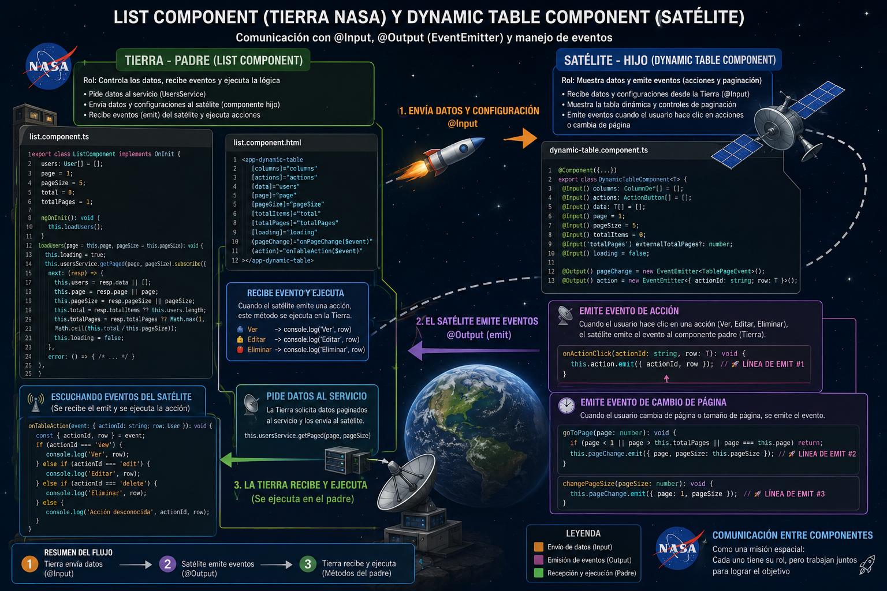
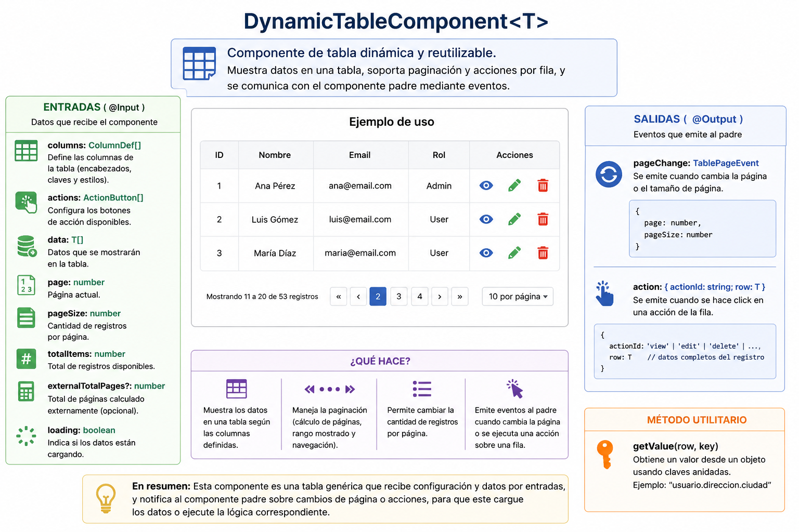
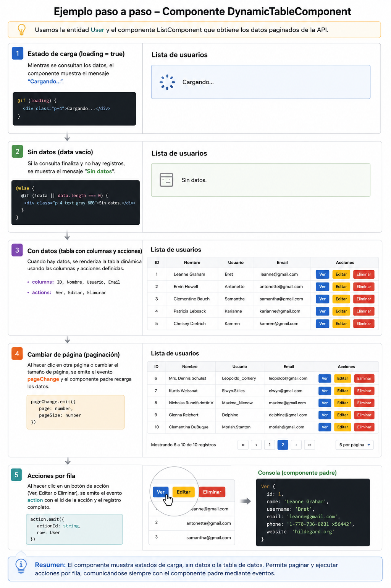
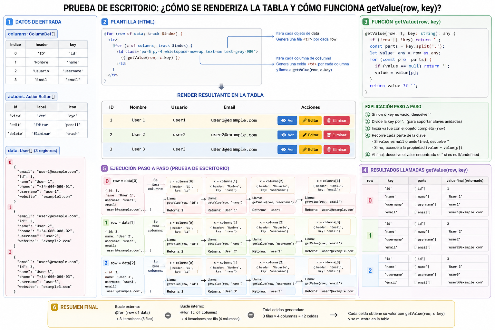
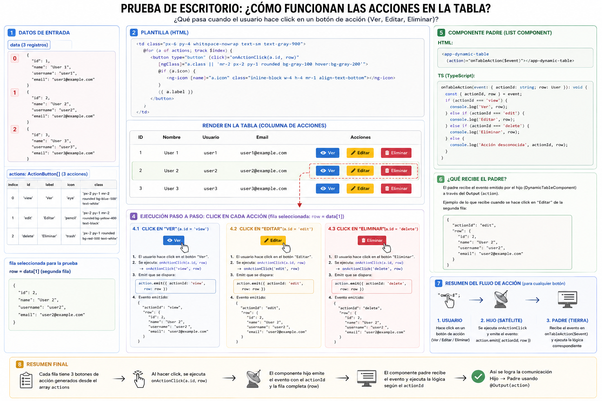

# Clase 2 Tabla Genérica

1. Para consumir ahora datos desde una api, y verlos en la componente dimámica, primero se debe configurar la variable de entorno.

Crear dentro de src/environments/environments.ts

``` typescript
export const environment = {
    production: false,
    apiUrl: 'http://127.0.0.1:5000'
};
```

2. Luego será necesario crear un servicio para hacer la conexión con el backend

``` sh
ng g service services/users
```

Internamente debe de tener el siguiente código

``` typescript
import { Injectable } from '@angular/core';
import { HttpClient, HttpParams } from '@angular/common/http';
import { Observable } from 'rxjs';

import { environment } from '../../environments/environments';
import { User } from '../models/user';

@Injectable({
  providedIn: 'root'
})
export class UsersService {

  private readonly apiUrl = `${environment.apiUrl}/users`;

  constructor(private http: HttpClient) {}

  /**
   * Obtener todos los usuarios
   * GET /users
   */
  getAll(): Observable<User[]> {
    return this.http.get<User[]>(this.apiUrl);
  }

  /**
   * Obtener usuarios paginados
   * GET /users?page=&pageSize=
   */
  getPaged(page: number, pageSize: number): Observable<{
    data: User[];
    page: number;
    pageSize: number;
    totalItems: number;
    totalPages: number;
  }> {
    const params = new HttpParams()
      .set('page', String(page))
      .set('pageSize', String(pageSize));
    return this.http.get<{
      data: User[];
      page: number;
      pageSize: number;
      totalItems: number;
      totalPages: number;
    }>(this.apiUrl, { params });
  }

  /**
   * Obtener usuario por ID
   * GET /users/:id
   */
  getById(id: number): Observable<User> {
    return this.http.get<User>(`${this.apiUrl}/${id}`);
  }

  /**
   * Crear usuario
   * POST /users
   */
  create(user: Omit<User, 'id'>): Observable<User> {
    return this.http.post<User>(this.apiUrl, user);
  }

  /**
   * Actualizar usuario completo
   * PUT /users/:id
   */
  update(id: number, user: User): Observable<User> {
    return this.http.put<User>(`${this.apiUrl}/${id}`, user);
  }

  /**
   * Eliminar usuario
   * DELETE /users/:id
   */
  delete(id: number): Observable<void> {
    return this.http.delete<void>(`${this.apiUrl}/${id}`);
  }
}
```

3. Crear los modelos requeridos en la carpeta `models/component-dynamic-table`

-  En el archivo `column-def.ts`, el atributo `header` es importante porque define el nombre visible de la columna en la tabla, facilitando la identificación de la información mostrada. El atributo `key` permite relacionar la columna con la propiedad específica de los datos que se desea visualizar, haciendo posible que la tabla muestre información dinámica. Finalmente, el atributo `class` brinda la posibilidad de aplicar estilos personalizados mediante clases CSS, mejorando la presentación y organización visual de la tabla.


``` typescript
//models/component-dynamic-table/column-def.ts

export interface ColumnDef {
  header: string;
  key: string;
  class?: string;
}
```

- En el archivo `action-button.ts`, el atributo `id` es importante porque permite identificar de manera única cada acción que puede ejecutarse dentro de la tabla, por ejemplo: `edit`, `delete` o `view`. El atributo `label` define el texto visible del botón, ayudando al usuario a reconocer la acción disponible. El atributo `class` permite aplicar estilos personalizados mediante clases CSS para mejorar la apariencia visual del botón. Finalmente, el atributo `icon` brinda la posibilidad de mostrar un ícono representativo, facilitando una identificación más rápida e intuitiva de la acción.

``` typescript
//models/component-dynamic-table/action-button.ts
export interface ActionButton {
  id: string;
  label: string;
  class?: string;
  icon?: string;
}
```

- En el archivo `table-page-event.ts`, el atributo `page` es importante porque indica el número de la página actual que se desea visualizar dentro de la tabla, permitiendo navegar entre los registros paginados. Por otro lado, el atributo `pageSize` define la cantidad de elementos que se mostrarán por página, por ejemplo: `5`, `10` o `25` registros, facilitando el control y organización de la información mostrada al usuario.


``` typescript
//models/component-dynamic-table/table-page.event.ts
export interface TablePageEvent {
  page: number;
  pageSize: number;
}

```


4. Instalar librería para iconos

```
npm install @ng-icons/core @ng-icons/heroicons
```

5. Posteriormente se debe programar en el archivo `pages/users/list/listcomponent.ts`

El archivo `list.component.ts` define el componente `ListComponent`, cuya función principal es consumir la información de usuarios desde el servicio `UsersService` y mostrarla utilizando la componente reutilizable `DynamicTableComponent`. Este componente configura las columnas de la tabla, las acciones disponibles por fila y controla la paginación de los datos.

Además, administra el estado de carga (`loading`), obtiene los usuarios desde la API mediante el método `loadUsers`, y responde a los eventos emitidos por la tabla, como cambios de página (`onPageChange`) o acciones ejecutadas sobre un registro (`onTableAction`), permitiendo manejar operaciones como ver, editar o eliminar usuarios.


``` typescript
import { Component, OnInit } from '@angular/core';
import { CommonModule } from '@angular/common';
import { UsersService } from 'src/app/services/users.service';
import { User } from 'src/app/models/user';
import { DynamicTableComponent } from 'src/app/components/ui/table/dynamic-table/dynamic-table.component';
import { ColumnDef } from 'src/app/models/component-dynamic-table/column-def';
import { ActionButton } from 'src/app/models/component-dynamic-table/action-button';
import { TablePageEvent } from 'src/app/models/component-dynamic-table/table-page-event';

@Component({
  selector: 'app-list',
  standalone: true,
  imports: [CommonModule, DynamicTableComponent],
  templateUrl: './list.component.html',
  styleUrl: './list.component.scss',
})
export class ListComponent implements OnInit {

  users: User[] = [];
  loading = false;

  page = 1;
  pageSize = 5;
  total = 0;
  totalPages = 1;

  columns: ColumnDef[] = [
    { header: 'ID', key: 'id' },
    { header: 'Nombre', key: 'name' },
    { header: 'Usuario', key: 'username' },
    { header: 'Email', key: 'email' },
  ];

  actions: ActionButton[] = [
    {
      id: 'view',
      label: 'Ver',
      icon: 'heroEye',
      class: 'flex-1 px-2 py-1 rounded bg-blue-500 text-white cursor-pointer flex items-center justify-center gap-1'
    },
    {
      id: 'edit',
      label: 'Editar',
      icon: 'heroPencil',
      class: 'flex-1 px-2 py-1 rounded bg-yellow-400 text-black cursor-pointer flex items-center justify-center gap-1'
    },
    {
      id: 'delete',
      label: 'Eliminar',
      icon: 'heroTrash',
      class: 'flex-1 px-2 py-1 rounded bg-red-500 text-white cursor-pointer flex items-center justify-center gap-1'
    }
  ];

  constructor(private usersService: UsersService) { }

  ngOnInit(): void {
    this.loadUsers();
  }

  loadUsers(page = this.page, pageSize = this.pageSize): void {
    this.loading = true;
    this.usersService.getPaged(page, pageSize).subscribe({
      next: (resp) => {
        this.users = resp.data || [];
        this.page = resp.page || page;
        this.pageSize = resp.pageSize || pageSize;
        this.total = resp.totalItems ?? this.users.length;
        this.totalPages = resp.totalPages ?? Math.max(1, Math.ceil(this.total / this.pageSize));
        this.loading = false;
      },
      error: () => {
        this.users = [];
        this.total = 0;
        this.totalPages = 1;
        this.loading = false;
      }
    });
  }
  onPageChange(event: TablePageEvent): void {
    this.page = event.page;
    this.pageSize = event.pageSize;
    console.log('Página cambiada:', event);
    this.loadUsers(this.page, this.pageSize);
  }

  onTableAction(event: { actionId: string; row: User }): void {
    const { actionId, row } = event;
    // Manejar acciones desde el componente padre
    if (actionId === 'view') {
      console.log('Ver', row);
    } else if (actionId === 'edit') {
      console.log('Editar', row);
    } else if (actionId === 'delete') {
      console.log('Eliminar', row);
    } else {
      console.log('Acción desconocida', actionId, row);
    }
  }

}
```
5. Creación de la componente en el proyecto, que servirá como tabla genérica, para listar cualquier entidad.
``` sh
ng g c components/ui/table/dynamic-table --standalone --skip-tests
```




6. El archivo `dynamic-table.component.ts` define una componente genérica y reutilizable llamada `DynamicTableComponent`, cuya función principal es mostrar información en forma de tabla dinámica con soporte para paginación, carga de datos y acciones sobre cada registro. Esta componente permite reutilizar una misma estructura para listar diferentes tipos de entidades, como usuarios, productos o clientes, evitando duplicar código y facilitando el mantenimiento de la aplicación. 
Entre los atributos de entrada (`@Input`) más importantes se encuentran `columns`, que define las columnas de la tabla; `actions`, que configura los botones de acción disponibles; y `data`, que contiene los registros que serán mostrados. También incluye atributos relacionados con la paginación, como `page`, `pageSize`, `totalItems` y `externalTotalPages`, además de `loading`, utilizado para controlar el estado de carga de la información.
Por otro lado, los atributos de salida (`@Output`) permiten la comunicación con el componente padre. El evento `pageChange` se utiliza para notificar cambios de página o de cantidad de registros por página, mientras que el evento `action` informa qué acción fue ejecutada sobre una fila específica, enviando tanto el identificador de la acción como los datos completos del registro seleccionado.



``` typescript
import { Component, EventEmitter, Input, Output } from '@angular/core';
import { CommonModule } from '@angular/common';
import { ColumnDef } from 'src/app/models/component-dynamic-table/column-def';
import { ActionButton } from 'src/app/models/component-dynamic-table/action-button';
import { TablePageEvent } from 'src/app/models/component-dynamic-table/table-page-event';
import { NgIcon, provideIcons } from '@ng-icons/core';
import * as heroIcons from '@ng-icons/heroicons/outline';


@Component({
  selector: 'app-dynamic-table',
  standalone: true,
  imports: [CommonModule,NgIcon],
  templateUrl: './dynamic-table.component.html',
  styleUrls: ['./dynamic-table.component.scss'],
  viewProviders: [
    provideIcons(heroIcons)
  ],
})
export class DynamicTableComponent<T extends Record<string, any>> {
  @Input() columns: ColumnDef[] = [];
  @Input() actions: ActionButton[] = [];
  @Input() data: T[] = [];

  @Input() page = 1;
  @Input() pageSize = 5;
  @Input() totalItems = 0;
  @Input('totalPages') externalTotalPages?: number;
  @Input() loading = false;

  @Output() pageChange = new EventEmitter<TablePageEvent>();
  @Output() action = new EventEmitter<{ actionId: string; row: T }>();

  /**
   * Calcular total de páginas basado en el total de registros y tamaño de página,
   * o usar el valor externo si se proporciona (útil cuando el total de páginas ya viene calculado desde el backend).
   * Esto permite que el componente sea flexible y pueda funcionar tanto con paginación manejada por el cliente como por el servidor.
   */
  get totalPages(): number {
    return this.externalTotalPages ?? Math.max(1, Math.ceil(this.totalItems / this.pageSize));
  }

  /**
   * Calcular el rango de registros que se están mostrando actualmente (desde - hasta),
   * para mostrarlo en la interfaz (ej: "Mostrando 11 a 20 de 53 registros").
   * Si no hay registros, mostrar "0 a 0".
   * Si el total de registros es menor que el tamaño de página, ajustar el rango para no mostrar un número mayor al total.
   */
  get fromItem(): number {
    return this.totalItems === 0 ? 0 : (this.page - 1) * this.pageSize + 1;
  }
  /**
   * Calcular el número del último registro que se muestra en la página actual,
   * asegurándose de no exceder el total de registros disponibles.
   * Si no hay registros, mostrar "0".
   */
  get toItem(): number {
    return Math.min(this.page * this.pageSize, this.totalItems);
  }

  /**
   * Emitir evento de cambio de página al componente padre,
   * quien se encargará de cargar los datos correspondientes a esa página.
   * @param page 
   * @returns 
   */
  goToPage(page: number): void {
    if (page < 1 || page > this.totalPages || page === this.page) return;

    this.pageChange.emit({
      page,
      pageSize: this.pageSize,
    });
  }
  /**
   * Detectar cambio en el tamaño de página (cantidad de registros por página),
   * y emitir evento al componente padre para que recargue los datos con el nuevo tamaño de página.
   * @param pageSize 
   */
  changePageSize(pageSize: number): void {
    this.pageChange.emit({
      page: 1,
      pageSize,
    });
  }
  /**
   * Capturar el evento de cual acción se hizo click (ver, actualizar, eliminar),
   * y luego emite al componente padre, quien se encargará de
   * manejar la lógica de cada acción.
   * @param actionId identificador de la acción (ej: 'view', 'edit', 'delete')
   * @param row registro completo de la fila donde se hizo click, 
   * para que el padre tenga toda la información necesaria para manejar la acción
   */
  onActionClick(actionId: string, row: T): void {
    this.action.emit({ actionId, row });
  }

  /** obtener valor por clave anidada */
  getValue(row: T, key: string): any {
    if (!row || !key) return '';
    const parts = key.split('.');
    let value: any = row as any;
    for (const p of parts) {
      if (value == null) return '';
      value = value[p];
    }
    return value ?? '';
  }
}
```

7. Programar el archivo de html de esa componente. 
`dynamic-table.html.ts`

Este código HTML corresponde a la vista de la componente `DynamicTableComponent` y su función principal es mostrar una tabla dinámica con soporte para estados de carga, visualización de datos, acciones por fila y paginación.

Inicialmente, el componente verifica si la información se encuentra cargando mediante la condición `loading`. Si el valor es verdadero, se muestra el mensaje “Cargando...”. Cuando la carga finaliza, el componente valida si existen datos en la variable `data`. Si no hay registros disponibles, se muestra el mensaje “Sin datos”.

Cuando sí existen datos, se renderiza dinámicamente una tabla HTML. El encabezado de la tabla (`thead`) se construye recorriendo la colección `columns`, mostrando el nombre de cada columna mediante `c.header` y aplicando estilos personalizados con `c.class`. Además, si existen acciones configuradas, se agrega automáticamente una columna adicional llamada “Acciones”.

En el cuerpo de la tabla (`tbody`), el componente recorre cada registro de `data` y genera una fila por cada elemento. Posteriormente, recorre nuevamente las columnas definidas para mostrar los valores correspondientes mediante el método `getValue(row, c.key)`, permitiendo acceder dinámicamente a la información de cada propiedad.

Si la tabla tiene acciones configuradas, se generan botones dinámicos para cada fila utilizando la colección `actions`. Cada botón ejecuta el método `onActionClick(a.id, row)` al hacer clic, enviando al componente padre el identificador de la acción y el registro seleccionado.

Finalmente, el componente incluye una sección de paginación que permite:

* seleccionar la cantidad de registros por página (`pageSize`)
* visualizar el rango actual de registros mostrados (`fromItem` y `toItem`)
* navegar entre páginas mediante botones de inicio, anterior, siguiente y última página

Cada cambio de página o tamaño de paginación emite eventos hacia el componente padre para recargar la información correspondiente.





``` html
@if (loading) {
<div class="p-4">Cargando...</div>
} @else {

@if (!data || data.length === 0) {
<div class="p-4 text-gray-600">Sin datos.</div>
}

@if (data && data.length > 0) {
<div class="overflow-x-auto">
    <table class="min-w-full divide-y divide-gray-200">

        <thead class="bg-gray-50">
            <tr>
                @for (c of columns; track $index) {
                <th [ngClass]="c.class"
                    class="px-6 py-3 text-left text-xs font-medium text-gray-500 uppercase tracking-wider">
                    {{ c.header }}
                </th>
                }

                @if (actions && actions.length) {
                <th class="px-6 py-3 text-left text-xs font-medium text-gray-500 uppercase tracking-wider">
                    Acciones
                </th>
                }
            </tr>
        </thead>

        <tbody class="bg-white divide-y divide-gray-200">
            @for (row of data; track $index) {
            <tr>
                @for (c of columns; track $index) {
                <td class="px-6 py-4 whitespace-nowrap text-sm text-gray-900">
                    {{ getValue(row, c.key) }}
                </td>
                }

                @if (actions && actions.length) {
                <td class="px-6 py-4 whitespace-nowrap text-sm text-gray-900">

                    <div class="flex gap-2">
                        @for (a of actions; track $index) {

                        <button type="button" (click)="onActionClick(a.id, row)"
                            [ngClass]="a.class || 'flex-1 px-2 py-1 rounded bg-gray-100 hover:bg-gray-200 cursor-pointer flex items-center justify-center gap-1'">

                            @if (a.icon) {
                            <ng-icon [name]="a.icon" class="w-4 h-4">
                            </ng-icon>
                            }

                            {{ a.label }}

                        </button>

                        }
                    </div>

                </td>
                }
            </tr>
            }
        </tbody>

    </table>
</div>
}

<div class="flex items-center justify-end gap-4 border-t border-gray-200 px-6 py-4 text-sm text-gray-600">

    <label class="flex items-center gap-2">
        Items per page:

        <select class="rounded-lg border border-gray-300 px-3 py-2" [value]="pageSize"
            (change)="changePageSize(+$any($event.target).value)">
            <option [value]="5">5</option>
            <option [value]="10">10</option>
            <option [value]="25">25</option>
            <option [value]="50">50</option>
        </select>
    </label>

    <span>
        {{ fromItem }} - {{ toItem }} de {{ totalItems }}
    </span>

    <button type="button" class="rounded-lg px-3 py-2 hover:bg-gray-100 disabled:opacity-40"
        [disabled]="page === 1 || loading" (click)="goToPage(1)">
        «
    </button>

    <button type="button" class="rounded-lg px-3 py-2 hover:bg-gray-100 disabled:opacity-40"
        [disabled]="page === 1 || loading" (click)="goToPage(page - 1)">
        ‹
    </button>

    <button type="button" class="rounded-lg px-3 py-2 hover:bg-gray-100 disabled:opacity-40"
        [disabled]="page === totalPages || loading" (click)="goToPage(page + 1)">
        ›
    </button>

    <button type="button" class="rounded-lg px-3 py-2 hover:bg-gray-100 disabled:opacity-40"
        [disabled]="page === totalPages || loading" (click)="goToPage(totalPages)">
        »
    </button>

</div>
}
```




8. Por último se debe programar el `pages/users/list.component.html` con el siguiente contenido

``` html
<app-dynamic-table
  [data]="users"
  [columns]="columns"
  [actions]="actions"
  [loading]="loading"
  [totalItems]="total"
  [totalPages]="totalPages"
  [page]="page"
  [pageSize]="pageSize"
  (pageChange)="onPageChange($event)"
  (action)="onTableAction($event)">
</app-dynamic-table>

```