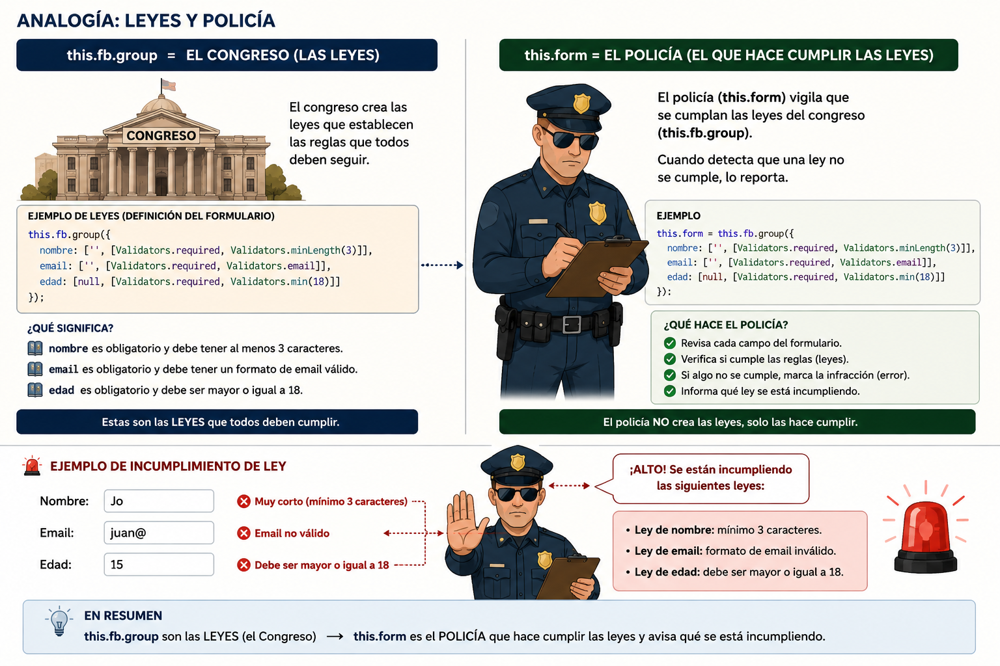

# Clase 3 Creación y Actulización
``` sh
ng g c pages/users/components/user-form --standalone --skip-tests
```

Programar en el controlador de la components `pages/users/components/user-form/user-form.component.ts`



``` typescript
// user-form.component.ts
import { Component, Input, Output, EventEmitter, OnInit } from '@angular/core';
import { Router } from '@angular/router';
import { FormBuilder, FormGroup, Validators, ReactiveFormsModule } from '@angular/forms';
import { MatButtonModule } from '@angular/material/button';
import { MatCardModule } from '@angular/material/card';
import { MatFormFieldModule } from '@angular/material/form-field';
import { MatInputModule } from '@angular/material/input';
import { User } from 'src/app/models/user';

@Component({
  selector: 'app-user-form',
  standalone: true,
  imports: [ReactiveFormsModule,
    ReactiveFormsModule,
    MatCardModule,
    MatFormFieldModule,
    MatInputModule,
    MatButtonModule
  ],
  templateUrl: './user-form.component.html',
})
export class UserFormComponent implements OnInit {
  @Input() user?: User;                          // undefined = crear, definido = editar
  @Output() formSubmit = new EventEmitter<User>(); // el padre decide qué hacer


  form!: FormGroup;
  isEditMode = false;
  

  /**
   * Getter para acceder fácilmente a los controles del formulario en la plantilla (ej: f.name, f.email, etc.),
   * lo que mejora la legibilidad del código HTML y evita tener que escribir form.controls.name cada vez.
   * Esto es especialmente útil para mostrar mensajes de error específicos para cada campo, como f.name.errors?.required.
   * Al usar este getter, el código en la plantilla se vuelve más limpio y fácil de entender.
   * Además, al ser un getter, se recalcula automáticamente cada vez que se accede a él, 
   * asegurando que siempre se tenga la referencia actualizada a los controles del formulario.
   */
  get f() { return this.form.controls; }

  constructor(private fb: FormBuilder, private router: Router) { }

  ngOnInit() {
    console.log('Inicializando UserFormComponent con user:', this.user);
    this.isEditMode = !!this.user;

    this.form = this.fb.group({
      name: [this.user?.name ?? '', Validators.required],
      username: [this.user?.username ?? '', Validators.required],
      email: [this.user?.email ?? '', [Validators.required, Validators.email]],
      phone: [this.user?.phone ?? '', [Validators.pattern(/^[0-9+\-\s()]{7,20}$/)]],
      website: [this.user?.website ?? '', [Validators.pattern(/^(https?:\/\/)?([\w-]+\.)+[\w-]{2,}(\/.*)?$/i)]],
    });
  }

  /**
   * Maneja el evento de envío del formulario, validando los datos ingresados y emitiendo un objeto User con los valores del formulario.
   * Si el formulario es inválido, no se emite ningún evento y se pueden mostrar mensajes de error en la plantilla.
   * El payload emitido incluye todos los campos del formulario, y si se está editando un usuario existente, también conserva el id.
   * 
   * @returns 
   */
  onSubmit() {
    console.log('Formulario enviado con valores:', this.form.value);
    if (this.form.invalid) return;

    const payload: User = {
      ...this.user,          // conserva el id si existe
      ...this.form.value,
    };

    this.formSubmit.emit(payload);
  }

  onCancel() {
    this.form.reset();
    // Navegar a la lista de usuarios (coincide con otros usos en el proyecto)
    this.router.navigate(['/users/list']);
  }
}
```

Programar en el controlador de la components `pages/users/components/user-form/user-form.component.html`

``` html
<!-- user-form.component.html -->
<mat-card class="cardWithShadow theme-card">
    <div class="p-6">
        <mat-card-title class="mb-0">
            {{ isEditMode ? 'Editar usuario' : 'Crear usuario' }}
        </mat-card-title>
    </div>

    <mat-card-content class="border-t border-border">
        <form [formGroup]="form" (ngSubmit)="onSubmit()">
            <div class="grid grid-cols-12 gap-x-6">

                <div class="col-span-12 lg:col-span-6">
                    <mat-label class="font-semibold mb-2 block">Nombre</mat-label>
                    <mat-form-field appearance="outline" class="w-full" color="primary">
                        <input matInput formControlName="name" placeholder="Ingrese el nombre" />
                        <mat-error [hidden]="!(f['name'].invalid && (f['name'].dirty || f['name'].touched))">
                            <span [hidden]="!f['name'].hasError('required')">El nombre es obligatorio.</span>
                        </mat-error>
                    </mat-form-field>
                </div>

                <div class="col-span-12 lg:col-span-6">
                    <mat-label class="font-semibold mb-2 block">Username</mat-label>
                    <mat-form-field appearance="outline" class="w-full" color="primary">
                        <input matInput formControlName="username" placeholder="Ingrese el username" />
                        <mat-error [hidden]="!(f['username'].invalid && (f['username'].dirty || f['username'].touched))">
                            <span [hidden]="!f['username'].hasError('required')">El username es obligatorio.</span>
                        </mat-error>
                    </mat-form-field>
                </div>

                <div class="col-span-12 lg:col-span-6">
                    <mat-label class="font-semibold mb-2 block">Email</mat-label>
                    <mat-form-field appearance="outline" class="w-full" color="primary">
                        <input matInput formControlName="email" type="email" placeholder="correo@ejemplo.com" />
                        <mat-error [hidden]="!(f['email'].invalid && (f['email'].dirty || f['email'].touched))">
                            <span [hidden]="!f['email'].hasError('required')">El email es obligatorio.</span>
                            <span [hidden]="!f['email'].hasError('email')">Ingrese un correo electrónico válido.</span>
                        </mat-error>
                    </mat-form-field>
                </div>

                <div class="col-span-12 lg:col-span-6">
                    <mat-label class="font-semibold mb-2 block">Teléfono</mat-label>
                    <mat-form-field appearance="outline" class="w-full" color="primary">
                        <input matInput formControlName="phone" placeholder="Ingrese el teléfono" />
                        <mat-error [hidden]="!(f['phone'].invalid && (f['phone'].dirty || f['phone'].touched))">
                            <span [hidden]="!f['phone'].hasError('pattern')">Teléfono inválido. Use sólo números y opcionales + - ( ) (7-20 caracteres).</span>
                        </mat-error>
                    </mat-form-field>
                </div>

                <div class="col-span-12">
                    <mat-label class="font-semibold mb-2 block">Sitio web</mat-label>
                    <mat-form-field appearance="outline" class="w-full" color="primary">
                        <input matInput formControlName="website" placeholder="www.ejemplo.com" />
                        <mat-error [hidden]="!(f['website'].invalid && (f['website'].dirty || f['website'].touched))">
                            <span [hidden]="!f['website'].hasError('pattern')">Sitio web inválido. Ingrese una URL válida (p. ej. https://www.ejemplo.com).</span>
                        </mat-error>
                    </mat-form-field>
                </div>

            </div>

            <div class="mt-3 flex gap-2">
                <button mat-flat-button color="primary" type="submit" [disabled]="form.invalid" class="w-36 flex justify-center items-center">
                    {{ isEditMode ? 'Actualizar' : 'Crear' }}
                </button>

                <button mat-flat-button color="warn" type="button" (click)="onCancel()" class="w-36 flex justify-center items-center">
                    Cancelar
                </button>
            </div>
        </form>
    </mat-card-content>
</mat-card>
```

Luego en `pages/users/create/create.component.ts`

``` typescript
import { Component } from '@angular/core';
import { Router } from '@angular/router';
import { UserFormComponent } from '../components/user-form/user-form.component';
import { User } from '../../../models/user';
import { UsersService } from 'src/app/services/users.service';


@Component({
  selector: 'app-create',
  imports: [UserFormComponent],
  templateUrl: './create.component.html',
  styleUrl: './create.component.scss',
})
export class CreateComponent {

  constructor(
    private router: Router,
    private userService: UsersService
  ) { }

  /**
   * Maneja el evento de envío del formulario para crear un nuevo usuario.
   * Recibe los datos del formulario como un objeto parcial de User (sin id),
   * llama al servicio para crear el usuario en el backend, y luego navega de 
   * regreso a la lista de usuarios.
   * El uso de Partial<User> permite que el formulario solo envíe los campos necesarios
   * para crear un nuevo usuario,
   * @param formValue 
   */

  onCreate(formValue: Partial<User>) {
    console.log('Crear usuario con datos:', formValue);
    this.userService.create(formValue).subscribe(() => {
      this.router.navigate(['/users/list']);
    });
  }
}
```
Luego en `pages/users/create/create.component.html`

``` html
<app-user-form 
    title="Crear usuario" 
    (formSubmit)="onCreate($event)" 
/>
```

Ahora en crear la componente Actualizar
``` typescript
import { Component, OnInit } from '@angular/core';
import { ActivatedRoute, Router } from '@angular/router';
import { UserFormComponent } from '../components/user-form/user-form.component';
import { UsersService } from 'src/app/services/users.service';
import { User } from 'src/app/models/user';

@Component({
  selector: 'app-update',
  imports: [UserFormComponent],
  templateUrl: './update.component.html',
  styleUrl: './update.component.scss',
})
export class UpdateComponent implements OnInit {
  user?: User;
  private id!: number;

  constructor(
    private route: ActivatedRoute,
    private router: Router,
    private usersService: UsersService
  ) {}

  ngOnInit(): void {
    const idParam = this.route.snapshot.paramMap.get('id');
    this.id = idParam ? Number(idParam) : NaN;
    console.log('ID del usuario a editar:', this.id);
    if (isNaN(this.id)) {
      this.router.navigate(['/users/list']);
      return;
    }

    this.usersService.getById(this.id).subscribe({
      next: (u) => {
        console.log('Usuario obtenido del servicio:', u);
        this.user = u;
      },
      error: () => this.router.navigate(['/users/list'])
    });
  }

  onUpdate(formValue: Partial<User>) {
    const payload: User = {
      id: this.id,
      ...(formValue as User)
    };

    this.usersService.update(this.id, payload).subscribe(() => {
      this.router.navigate(['/users/list']);
    });
  }

}
```

Y ahora en el html

```
@if (user) {
<app-user-form [user]="user" (formSubmit)="onUpdate($event)">
</app-user-form>
} @else {
<p>Cargando usuario...</p>
}
```